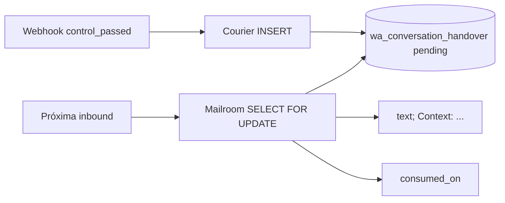

# Tabela `wa_conversation_handover` (RapidPro / flows)

Pré-requisito dos planos de orquestração no Courier/Mailroom:

- [wa_conversation_orchestration](file:///home/robi/trabalho/rapidpro-dev-kit/weni/sources/courier/.cursor/plans/wa_conversation_orchestration_50ccdb54.plan.md)
- [orchestration_phase_2](file:///home/robi/trabalho/rapidpro-dev-kit/weni/sources/courier/.cursor/plans/orchestration_phase_2_af9e77b0.plan.md)

**Escopo:** só [rapidpro](file:///home/robi/trabalho/rapidpro-india/rapidpro) — model + migration + testes. Sem API REST, sem UI, sem lógica de webhook.

O negócio **não assina standby**. O contexto (history **ou** summary, mutuamente exclusivos) chega só em `messaging_handovers` / `control_passed`. Guardamos nesse row até a **próxima msg do contato**; o mailroom então formata `TEXTO; Context: HISTORY/SUMMARY` e marca `consumed_on`.

Padrão de escrita: igual CTWA — RapidPro dono do schema; Courier faz `INSERT` SQL em [`backends/rapidpro`](file:///home/robi/trabalho/rapidpro-dev-kit/weni/sources/courier/backends/rapidpro/ctwa.go).



## Model

Em [`temba/flows/models.py`](temba/flows/models.py), ao lado de `IntegrationRequest`:

```python
class WAConversationHandover(models.Model):
    CONTEXT_TYPE_HISTORY = "history"
    CONTEXT_TYPE_SUMMARY = "summary"
    CONTEXT_TYPE_CHOICES = (
        (CONTEXT_TYPE_HISTORY, "History"),
        (CONTEXT_TYPE_SUMMARY, "Summary"),
    )

    org = models.ForeignKey(Org, related_name="wa_conversation_handovers", on_delete=models.PROTECT)
    channel = models.ForeignKey(Channel, related_name="wa_conversation_handovers", on_delete=models.PROTECT)
    contact = models.ForeignKey("contacts.Contact", related_name="wa_conversation_handovers", on_delete=models.PROTECT)
    contact_urn = models.CharField(max_length=255)

    context_type = models.CharField(max_length=16, choices=CONTEXT_TYPE_CHOICES)
    context_text = models.TextField()          # já renderizado para injetar no text
    context_payload = JSONField(null=True)     # conversation_context cru da Meta

    previous_owner_app_id = models.CharField(max_length=64, null=True, blank=True)
    previous_owner_app_role = models.CharField(max_length=64, null=True, blank=True)
    previous_owner_business_id = models.CharField(max_length=64, null=True, blank=True)
    handover_metadata = models.CharField(max_length=255, null=True, blank=True)  # reason string

    occurred_on = models.DateTimeField()
    created_on = models.DateTimeField(default=timezone.now)
    consumed_on = models.DateTimeField(null=True, blank=True)
    consumed_msg_id = models.BigIntegerField(null=True, blank=True)

    class Meta:
        db_table = "wa_conversation_handover"
```

### Campos

| Campo | Uso |
|---|---|
| `contact_urn` | Lookup do Courier/Mailroom sem join extra (`whatsapp:55...`) |
| `context_type` | `history` ou `summary` — CHECK no DB |
| `context_text` | String pronta para o sufixo `Context: ...`. Summary = `summary.text`. History = transcript dos `items` (ver render abaixo) |
| `context_payload` | JSON original (debug / re-render) |
| `consumed_on` | `NULL` = pending. Mailroom seta ao anexar na inbound |
| `consumed_msg_id` | `msgs_msg.id` da inbound que consumiu (auditoria) |

Não gravar `history.items` como rows em `msgs_msg`.

### Render de `context_text`

- **summary:** `conversation_context.summary.text` (trim). Vazio → não persistir contexto (ainda podemos gravar o handover sem text? **Não** — sem history/summary o row não serve à Fase 2; Courier ACK 200 e não insere).
- **history:** transcript estável, uma linha por item, ordem da Meta:

```
[user] texto
[business] texto
```

Usar `from` / role do item quando a Meta mandar; senão `user`/`business` pelo app id. Itens sem texto (só mídia) entram como `[user] <image>` etc. Se o transcript passar de **32k** chars, truncar pelo fim (itens mais antigos) e prefixar `[truncated]`.

## Constraints e índices

Migration `0265_wa_conversation_handover.py` (última em flows hoje: `0264_alter_flowstart_contacts_sequence`).

- `chk_wa_conv_handover_context_type`: `context_type IN ('history', 'summary')`
- Índice de consumo: `(channel_id, contact_id, consumed_on)` — mailroom busca pending
- Índice por URN: `(org_id, contact_urn, consumed_on)` — fallback se contact_id ainda não bater
- **Unique parcial** (Postgres): `UNIQUE (channel_id, contact_id) WHERE consumed_on IS NULL`

Um contato só tem **um** handover pending por canal. Novo `control_passed` **substitui** o pending (Courier `INSERT ... ON CONFLICT DO UPDATE` no unique parcial, ou `UPDATE` + insert). Assim retries da Meta e handovers em sequência não empilham.

Índice auxiliar `(channel_id, contact_id, -occurred_on)` para listar histórico já consumido se precisar.

## Quem escreve / lê

| Serviço | Operação |
|---|---|
| Courier | `INSERT` (ou upsert do pending) após resolver contact via URN. **Não** enfileira `msg_event` |
| Mailroom | `SELECT ... WHERE channel_id=? AND contact_id=? AND consumed_on IS NULL`, depois `UPDATE consumed_on, consumed_msg_id` na mesma transação do handle |
| RapidPro | Dono do schema. Sem views nesta fatia |

Courier resolve contact como em [`writeChannelEventToDB`](file:///home/robi/trabalho/rapidpro-dev-kit/weni/sources/courier/backends/rapidpro/channel_event.go) (`contactForURN`). Colunas concretas que o SQL do Courier precisa: `org_id`, `channel_id`, `contact_id`, `contact_urn`, `context_type`, `context_text`, `context_payload`, `previous_owner_*`, `handover_metadata`, `occurred_on`, `created_on`.

TTL: não expirar no RapidPro nesta fatia. Janela da Meta é 24h; pending velho some no consume ou num job futuro.

## Testes (RapidPro)

- Create history + summary
- CHECK rejeita `context_type` inválido
- Segundo pending no mesmo `(channel, contact)` viola unique / é substituído
- `consumed_on` setado libera um novo pending
- `related_name` `contact.wa_conversation_handovers` / `org.wa_conversation_handovers`

## Fora deste plano

- Parser do webhook (Courier Fase 1)
- Formato `TEXTO; Context:` no POST do Brain (Fase 2 / mailroom)
- Thread Control API
- Admin / API v2
